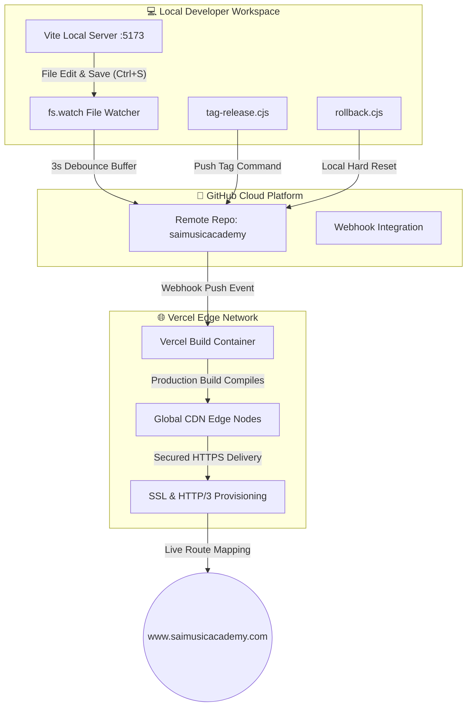

# 📘 Sai Music Academy — Complete Operations & Devops Manual

Welcome to the official, comprehensive operations and developer operations manual for **Sai Music Academy**. This document is a complete, start-to-finish guide documenting the architecture, setup, configuration, and day-to-day management of your website, local synchronization, GitHub repository, and live Vercel cloud environment.

---

## 🗺️ System Architecture & Data Flow

Below is the complete architectural map showing how your local workspace, GitHub repository, Vercel edge network, and user domain sync in real-time, along with the rollback pipeline:



---

## 💻 Section 1: Local Development & Verification

Your application is built using **Vite, React, and TypeScript**—a state-of-the-art framework for creating blazingly fast single-page web applications.

### 1.1 Running the Local Development Server
To launch the hot-reloading development server on your machine:
1. Open your Mac **Terminal**.
2. Navigate to your project folder:
   ```bash
   cd "/Users/ganeshbabu/Desktop/house plan 2026/WEB UI/final demo"
   ```
3. Start the dev server:
   ```bash
   npm run dev
   ```
4. Open [http://localhost:5173](http://localhost:5173) in your web browser. Any changes you make in your code editor will reflect on this local screen instantly.

### 1.2 Resolving the "Blank Screen" Issue
*   **The Problem**: Previously, during development, the screen would randomly turn blank due to the `vite-plugin-singlefile` plugin continuously compiling the modular files into a single bundle, breaking Vite's Hot Module Replacement (HMR).
*   **The Fix**: We updated `vite.config.ts` to only invoke `viteSingleFile()` during production compiles, ensuring development is stable and hot-reloading works flawlessly.

---

## 🐙 Section 2: GitHub Repository Setup & Authentication

We successfully created and authenticated the public repository [GaneshBabu777/saimusicacademy](https://github.com/GaneshBabu777/saimusicacademy) to serve as your secure code backup and source of truth.

### 2.1 Bypassing Interactive Login Errors
*   **The Problem**: While running standard Git authentication, terminal browser auth failed with device/access code errors.
*   **The Solution**: We acquired a secure GitHub fine-grained **Personal Access Token (PAT)**:
    `github_pat_11BJK...[YOUR_SECURE_TOKEN]...8QupZb`
*   **How We Configured Git**: We permanently injected the token directly into the local repository's origin remote URL:
    ```bash
    git remote set-url origin https://github_pat_11BJK...[YOUR_SECURE_TOKEN]...8QupZb@github.com/GaneshBabu777/saimusicacademy.git
    ```
    This guarantees that the local machine and background daemons can **push and sync code seamlessly** without ever asking for passwords or authentication prompts.


---

## 🌐 Section 3: Vercel Cloud Hosting & Custom Domains

Vercel hosts your application globally on its high-speed edge network for free, provisioning secure HTTPS, HTTP/3, and edge caching automatically.

### 3.1 Vercel Configuration (`vercel.json`)
We created a custom production config file in your root folder (`vercel.json`) to enforce enterprise-grade security and fast-loading rules:
*   **Clean URLs**: Enables clean routing without trailing `.html` extensions.
*   **HTTP Strict Transport Security (HSTS)**: Forces all traffic over secured HTTPS (Port 443).
*   **Edge Asset Caching**: Optimizes static load times by caching the hero background video (`/hero-music.mp4`) and images on Vercel's global edge network for a full year:
    ```json
    "headers": [
      {
        "source": "/hero-music.mp4",
        "headers": [{ "key": "Cache-Control", "value": "public, max-age=31536000, immutable" }]
      }
    ]
    ```

### 3.2 Mapping Your Custom Domain (`www.saimusicacademy.com`)
To connect your custom domain to Vercel's edge servers, add the following two DNS records in your domain registrar's panel (e.g., Hostinger, GoDaddy, Namecheap):

| Record Type | Name / Host | Target / Points To | TTL |
| :--- | :--- | :--- | :--- |
| **A** | `@` | `76.76.21.21` | Default / Auto |
| **CNAME** | `www` | `cname.vercel-dns.com.` | Default / Auto |

After adding these DNS records, bind the domain in your Vercel Project under **Settings > Domains**. Vercel will verify the DNS records and issue a free SSL certificate automatically.

---

## ⚡ Section 4: Real-Time Local-to-Cloud Sync Engine

To completely eliminate manual pushes and updates, we built `auto-sync.cjs`—a custom, background file watcher daemon.

### 4.1 How it Works Under the Hood
1.  **Directories Watched**: Monitors modifications, additions, and deletions in `src/`, `public/`, `index.html`, `vite.config.ts`, `vercel.json`, and `package.json`.
2.  **Debounce Cooldown (3 seconds)**: To avoid upload loops and terminal spam while you are actively typing and saving files, it uses a 3-second buffer. Once you stop saving files for 3 seconds, it packages all accumulated modifications.
3.  **Auto Pushing**: It automatically performs a local git add, registers a timestamped commit message (`Auto-sync: local save on 11:46:47 AM`), and pushes it to GitHub, immediately triggering a live Vercel cloud rebuild.

### 4.2 Starting the Sync Daemon
If you ever close your editor, restart your Mac, or stop the background service, you can easily restart the watcher:
```bash
node auto-sync.cjs
```
*Tip: Keep this terminal tab running in the background as you work to view real-time log outputs!*

---

## 🔄 Section 5: Versioning & Rollback Operations

We developed a robust, double-confirmed version control and rollback engine so that you can easily bookmark stable versions and safely restore previous versions if anything goes wrong.

### 5.1 Tagging a Stable Milestone (`tag-release.cjs`)
Whenever you hit a milestone, complete a design revision, or prepare a stable version, create a permanent bookmark:
```bash
node tag-release.cjs v1.0.0
```
*(If you do not pass a name, the terminal will prompt you to enter one.)*
This creates an annotated Git release tag and pushes it to GitHub.

### 5.2 Executing a Double-Confirmed Cloud Rollback (`rollback.cjs`)
If you need to roll back both your local workspace and your live Vercel website to a previous commit or tag:
1.  Run the rollback command in your terminal:
    ```bash
    node rollback.cjs
    ```
2.  **Safety Step — Uncommitted Work**: If you have unsaved changes in your workspace, the script warns you and gives you three options:
    *   **Stash**: Safely stores your changes in Git's memory so you can recover them later.
    *   **Discard**: Deletes unsaved changes permanently.
    *   **Cancel**: Cancels the rollback.
3.  **Color-Coded Interactive Menu**: The engine displays the last 5 automatic saves (commits) and all stable milestone releases (tags). Select the version you want (e.g. `2` or `T1`).
4.  **Double-Confirmation**: A prominent warning appears informing you that your live website will be overwritten. You must type **`YES`** in capital letters to confirm!
5.  **Execution & Push**: The engine runs `git reset --hard` to revert your local files, and force-pushes it to GitHub (`git push origin main --force`), which immediately triggers Vercel to rebuild and redeploy that exact rolled-back version live on your domain.

---

## 🛠️ Daily DevOps Cheat Sheet

Save this quick reference table for daily commands:

| Action | Command | Target / Output |
| :--- | :--- | :--- |
| **Start Dev Server** | `npm run dev` | Runs local server at [http://localhost:5173](http://localhost:5173) |
| **Start Live Auto-Sync** | `node auto-sync.cjs` | Monitors and uploads saves to GitHub & Vercel in 3 seconds. |
| **Create Milestone Save** | `node tag-release.cjs [tag]` | Creates a stable release bookmark (e.g. `v1.0.0`) on GitHub. |
| **Restore Previous Version**| `node rollback.cjs` | Opens the interactive menu to safely roll back both local and live site. |

---

> [!NOTE]
> All scripts and settings have been written using **CommonJS module specifications (`.cjs`)** to prevent conflicts with Vite's modern ES module structure (`"type": "module"` in `package.json`).
