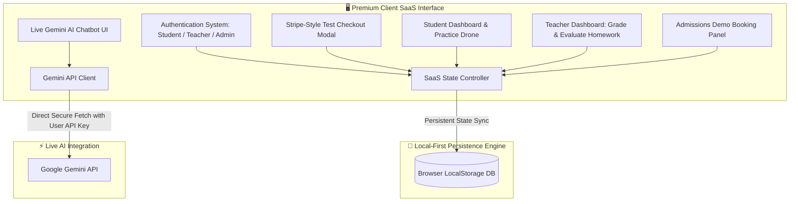

# Implementation Plan — Competitor-Grade Upgrade (bMusician Analysis)

This implementation plan details the architectural and functional upgrades to elevate **Sai Music Academy** to the standards of premium competitor platforms like **bMusician.com**. It introduces a premium, multi-field **Demo Booking System**, a dedicated **Teacher Dashboard (Guru Portal)** for assignment evaluation, and a secure client-side **Google Gemini AI Chatbot** integration.

---

## 🗺️ Architectural Concept

---

## 🚀 Key Functional Features

### 1. Competitor-Grade Demo Booking System ("Schedule a Demo")
Based on the bMusician model, we will replace the static contact form and basic inquiry capture with an ultra-premium, interactive **Demo Booking Panel**:
* **22 Dedicated Disciplines**: A searchable course dropdown selector featuring classical and contemporary programs:
  * *Vocals*: Carnatic Vocal, Hindustani Vocal, Western Vocal.
  * *Percussion*: Mridangam, Tabla, Ghatam, Kanjira, Konnakol, Cajon, Morsing.
  * *Melodic Instruments*: Veena, Violin, Flute, Keyboard, Guitar, Sitar, Mandolin, Saxophone, Harmonium, Recorder.
  * *Dance & Wellness*: Bharatanatyam, Yoga.
* **Skill Level Picker**: Select level from *Beginner*, *Intermediate*, *Advanced*, and *Super Advanced*.
* **Date Picker**: Integrated calendar to choose preferred booking date.
* **Flexible Time Windows**: Choose convenient slots:
  * `Morning (7:00 AM - 10:00 AM)`
  * `Midday (11:00 AM - 2:00 PM)`
  * `Afternoon (3:00 PM - 6:00 PM)`
  * `Evening (7:00 PM - 10:00 PM)`
* **Admin Visibility**: Bookings are saved under a new `DemoBooking[]` array in `localStorage` and made visible under a dedicated **🎯 Demo Bookings** tab in the SaaS Admin Panel.

### 2. Live Guru Portal (Dedicated Teacher Dashboard)
We will introduce a third primary role: `teacher@saimusicacademy.com` / `teacher123`. When logged in, they bypass student/admin screens and access a customized **Teacher Control Desk**:
* **Pending Student Submissions**: List all student homework assignments that have been submitted (status is `"submitted"`).
* **Interactive Grading & Feedback Workspace**: 
  * Select any student's homework submission.
  * View their submitted answers/recording references.
  * Select a Grade (`A+`, `A`, `B+`, `B`, `C`, etc.) from a clean dropdown.
  * Write personalized feedback notes guiding their practice.
  * Submit the evaluation. This instantly updates the assignment's status to `"graded"`, persists it to `localStorage`, and updates the student's dashboard in real-time.
* **Add Live Class Slots**: A simplified slot scheduler for teachers to add availability slots.
* **Teacher Earnings & Hours Tracker**: Visual simulated dashboard statistics tracking completed grading and teaching hours.

### 3. Settings-Driven Gemini AI Assistant
We will rebuild the bottom-right chatbot to support direct live Gemini AI calls:
* **Settings Gear Icon**: Adds a subtle configuration gear `⚙️` inside the chatbot header. Clicking it reveals a secure field to input a free Gemini API Key (which is stored safely in `localStorage` as `sai-gemini-key`).
* **Direct Client Fetch**: Call Google's official Gemini endpoint (`https://generativelanguage.googleapis.com/v1beta/models/gemini-2.0-flash:generateContent`) directly from the browser using a secure `fetch` client (zero backend server cost).
* **Indian Classical System Pre-Prompting**: Instruct Gemini to act as the master virtual registrar for Sai Music Academy. It is preloaded with details of the 22 courses, the updated membership plans (Beginner, Intermediate, Advanced), trial policies, and support handoffs.
* **Smart Offline Fallback**: Retains the robust keyword fallback router if no API key is set, reminding the user to set their key to enjoy full AI conversations.

---

## 📁 Proposed Changes

### [MODIFY] [App.tsx](file:///Users/ganeshbabu/Desktop/house%20plan%202026/WEB%20UI/final%20demo/src/App.tsx)
We will modify the core file to implement the new types, roles, state hooks, and dashboard blocks:
1. **Extend User Types & Local State**:
   * Add `"teacher"` to the `User` role type union.
   * Add `DemoBooking` type and `demoBookings` local state hook synced to `localStorage`.
2. **Rebuild `AuthPage`**:
   * Add a third quick-access button: **Teacher Portal** (`teacher@saimusicacademy.com` / `teacher123`).
   * Add dynamic login resolver provisioning the teacher role and matching teacher account objects.
3. **Redesign `ContactPage`**:
   * Re-write the contact form into the ultra-premium **Schedule a Demo** container with HSL gold/slate accents, course selectors, level buttons, and date/slot pickers.
4. **Implement Teacher Dashboard View**:
   * If logged in user is a teacher: Render the custom Guru Portal, showing outstanding submissions, grading form, slot planner, and stats.
5. **Upgrade SaaS Admin Panel**:
   * Add a dedicated **🎯 Demo Bookings** tab next to financial metrics, users, and tickets to display incoming lead forms, dates, and courses.
6. **Rebuild `Chatbot`**:
   * Add a settings gear and state hooks for saving `sai-gemini-key`.
   * Add `sendToGemini` asynchronous fetch helper with Carnatic pre-prompts and stream/text response handler.

---

## 🧪 Verification Plan

### Automated & Manual Verification Steps
1. **Demo Booking Submission**:
   * Navigate to the **Contact** page.
   * Fill out the "Schedule a Demo" form (Select *Carnatic Vocal*, *Beginner*, pick tomorrow's date, and select *Evening* slot).
   * Submit and verify that the confirmation toast shows.
2. **SaaS Admin Validation**:
   * Sign in as `admin@saimusicacademy.com` / `admin123`.
   * Go to the **Demo Bookings** tab and verify the booking is listed with accurate selections.
3. **Teacher Logging & Evaluation**:
   * Sign in as `student@saimusicacademy.com` / `student123`.
   * Go to Assignments, type a text submission for "Sarali Varisai Speed 1 & 2", and submit.
   * Log out and sign in as `teacher@saimusicacademy.com` / `teacher123`.
   * Verify the **Guru Portal** displays Ramesh Kumar's pending submission.
   * Click on the submission, assign an `A+` grade, type a custom instruction, and click submit.
   * Log back in as the student and verify the evaluated grade and feedback show in the student's assignment cards.
4. **Gemini Chatbot Test**:
   * Click the chatbot button and click the `⚙️` settings icon.
   * Enter a valid Gemini API Key, close settings, and send a message: *"Tell me about the 22 classical courses you teach."*
   * Verify that a live AI response details the 22 courses.
   * Clear the API Key and verify it gracefully falls back to offline guidance.

---

> [!TIP]
> This upgrade maintains full client-side execution, bypassing database and server costs, keeping the entire application lightweight and completely hosted on Vercel for free.
