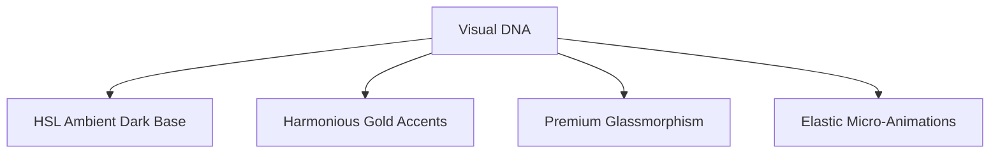

# 🎨 Sai Music Academy — Design System & UI/UX Guidelines

Welcome to the design system specification for **Sai Music Academy**. This document defines the visual DNA, color palette, typography hierarchy, component guidelines, micro-interactions, and layout breakpoints that define our high-fidelity, premium user experience.

---

## 🗺️ Visual Theme & DNA
Sai Music Academy leverages a **premium ambient dark theme** combined with **gold and cream branding accents**, designed to evoke the elegance and heritage of Indian classical music while feeling modern, sleek, and responsive.



---

## 🎨 Color Palette Specification
To maintain visual harmony, colors are specified using HSL (Hue, Saturation, Lightness) tokens to enable seamless opacity layers.

### 1. Brand Accents
*   **Gold Main (`--gold`):** `hsl(41, 62%, 58%)` (#D4A853) - Primary accent for borders, highlight typography, and primary button hover states.
*   **Gold Light (`--gold-light`):** `hsl(42, 82%, 68%)` (#F0C96B) - Highlight accents and hover text.
*   **Gold Dark (`--gold-dark`):** `hsl(39, 54%, 41%)` (#A07830) - Disabled states, inactive tab borders, and shadow gradients.

### 2. Base Surfaces (Dark Ambient)
*   **Deep Base (`--deep`):** `hsl(0, 0%, 0%)` (#000000) - Primary page background.
*   **Deep Surface (`--deep2`):** `hsl(0, 0%, 4%)` (#090909) - Secondary sections (testimonials, features).
*   **Card Base (`--deep3`):** `hsl(0, 0%, 7%)` (#121212) - Background panel surfaces.

---

## ✍️ Typography Scale
*   **Main Font Family:** `'Readex Pro', system-ui, -apple-system, sans-serif` - Clean, geometric, and highly readable.
*   **Serif Accent Font Family:** `'Playfair Display', serif` - Styled italic headings for courses and testimonials.

| Usage | Size | Weight | Line Height | Letter Spacing |
| :--- | :--- | :--- | :--- | :--- |
| **Hero Title** | `clamp(2.5rem, 8vw, 5.5rem)`| 900 | 0.95 | `-0.04em` |
| **Section Title** | `clamp(2.0rem, 5vw, 3.5rem)`| 800 | 1.1 | `-0.02em` |
| **Subheadings** | `1.25rem` | 500 | 1.4 | `normal` |
| **Body Copy** | `0.95rem` | 400 | 1.6 | `normal` |
| **Captions / Details**| `0.8rem` | 300 | 1.5 | `+0.05em` |

---

## 🫧 Component Design System

### 1. Premium Glassmorphic Cards (`.premium-card`)
Cards refract background lighting and feature subtle borders to stand out in the dark layout.
```css
.premium-card {
  background: rgba(18, 18, 18, 0.45) !important;
  backdrop-filter: blur(16px) !important;
  -webkit-backdrop-filter: blur(16px) !important;
  border: 1px solid rgba(255, 255, 255, 0.08) !important;
  box-shadow: 0 10px 30px rgba(0, 0, 0, 0.3) !important;
  transition: transform 0.4s cubic-bezier(0.16, 1, 0.3, 1), 
              border-color 0.3s ease, 
              box-shadow 0.3s ease !important;
}
```

### 2. High-Impact Interactive Buttons
*   **Primary Button:** Features a solid gold background with black text, scaling slightly on hover.
*   **Secondary/Translucent Button:** Translucent borders that transition to solid gold borders with an inner glow.

---

## ⚡ Animations & Micro-Interactions
*   **Easing Curve:** `cubic-bezier(0.16, 1, 0.3, 1)` - Decelerates smoothly for natural feel.
*   **Dynamic Reveal (`data-reveal`):** Intercepted by viewport scroll observers to fade up items by `30px` upon scrolling.
*   **Hover Lift Effect:** Translucent elements translate upwards by `-8px` on mouse hover, reflecting light sweeps.

---

## 📱 Breakpoints & Responsiveness
We build mobile-first responsive systems:
*   **Mobile (`< 768px`):** Single column layouts, smaller margins, absolute CTAs.
*   **Tablet (`768px - 1024px`):** Two-column grids, inline navigation.
*   **Desktop (`> 1024px`):** Full column marquee, custom dashboard grids, and interactive audio drone interfaces.
