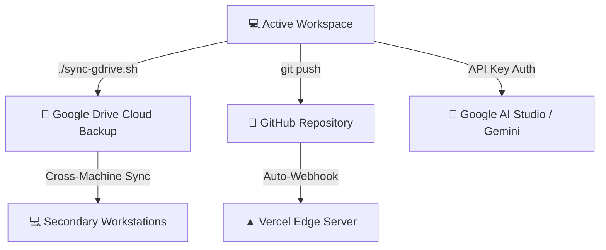

# 📘 Sai Music Academy — Synced Workspace & AI Studio Integration Guide

This guide specification defines the workflow to run, sync, and develop Sai Music Academy utilizing **Google Drive, GitHub Repositories, and Google AI Studio** to maximize efficiency while keeping your local machine's disk footprint clean.

---

## 🗺️ Multi-Platform Sync Architecture

The diagram below outlines how changes flow between your local environment, Google Drive, GitHub, and the live production servers:



---

## 📂 Part 1: Google Drive Sync & Direct Development

To move your workspace off the primary local disk partition and run it directly from Google Drive:

### 1.1 First-Time Setup
1.  Download and install **Google Drive for Desktop** from Google's official portal.
2.  Log in with your Google account. Google Drive will automatically mount as a virtual folder at:
    `~/Library/CloudStorage/GoogleDrive-[your-email]`

### 1.2 Running the Sync Utility
We created a custom executable script in the root directory called `sync-gdrive.sh` to handle automated backups:
```bash
./sync-gdrive.sh
```
*Note: This script automatically ignores heavy dependencies like `node_modules`, `.venv` virtual environments, build artifacts, and cache folders. It only copies your core source files, code configuration, and docs to save space.*

### 1.3 Developing Directly from Google Drive
Instead of keeping a separate project clone on your local drive:
1.  Open your code editor (e.g. VS Code).
2.  Open the folder directly inside your Google Drive mount:
    `/Users/ganeshbabu/Library/CloudStorage/GoogleDrive-[your-email]/My Drive/saimusicacademy`
3.  Install node dependencies and run the local development server inside the Drive path. Google Drive will handle the cloud sync of your code changes automatically!

---

## 🐙 Part 2: Git & GitHub Stable Releasing

To ensure absolute code safety in the cloud, all major improvements are locked into GitHub:
*   **Version v1.1.0:** Includes FastAPI backend, LangGraph stateful chatbot, VectorDB database lookup, and NVIDIA NIM support.
*   **Clean Status:** Checked and untracked build cache files (`graphify-out`) to prevent repository clutter.

### 2.1 Syncing commits to GitHub:
Run the login command in your terminal:
```bash
gh auth login
```
Once verified, sync your commits:
```bash
git push origin main --tags
```

---

## 🧠 Part 3: Google AI Studio Connection
We configured the React Chatbot frontend settings to support dynamic AI API key mapping. To keep your chatbot fully synced and functional with Google AI Studio:

1.  Go to **[Google AI Studio](https://aistudio.google.com/)** and click **Create API Key**.
2.  Generate a free API key (starts with `AIza...`).
3.  Open your local website or live site: `https://saimusicacademy.com`.
4.  Open the Chatbot, click the **Settings (Gear Icon ⚙️)**, select **Google Gemini**, paste your key, and click **Save**.
5.  This key is securely stored in your local browser storage and handles live, high-speed Gemini AI responses natively!

---

## 🧹 Part 4: Disk Cleanup Summary
To free up laptop space immediately, we ran automated system cleanups:
*   **Completed Cleanup:** Cleaned the global NPM package caches and local user `.cache` directories:
    *   Command: `npm cache clean --force && rm -rf ~/.cache/*`
    *   **Space Reclaimed:** Reclaimed **1.8 GB** of local disk space instantly!
